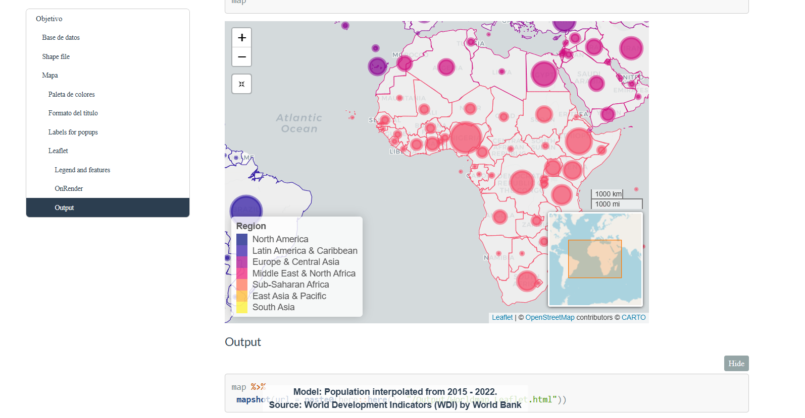
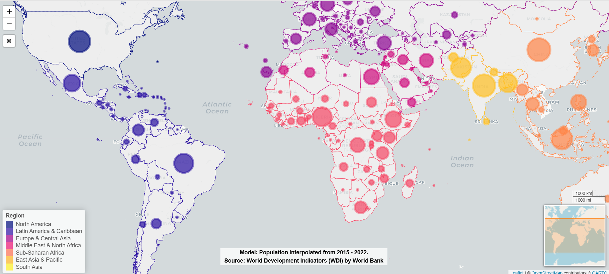

<!-- README.md is generated from README.Rmd. Please edit that file -->

<!-- badges: start -->

[](https://github.com/r-lib/usethis/actions/workflows/R-CMD-check.yaml)

<!-- badges: end -->

```{r, include = FALSE}
knitr::opts_chunk$set(
  collapse = TRUE,
  comment = "#>"
)
#usethis::use_readme_rmd()
```

# Repositorio de Mapas en `R`

### Leaflet del Mundo   

Estructura general del leaflet 

**Enlace:** https://dvillasanao.github.io/Simple_Maps/Output/01_WorldLeaflet.html 

<html>
<body>
  <a href = "https://dvillasanao.github.io/Simple_Maps/Output/01_WorldLeaflet.html" target="_blank">

  </a>
</body>
</html>


### Mapa 

**Enlace:** https://dvillasanao.github.io/Simple_Maps/Output/Worldmap_Leaflet.html

<html>
<body>
  <a href = "https://dvillasanao.github.io/Simple_Maps/Output/Worldmap_Leaflet.html" target="_blank">

  </a>
</body>
</html>